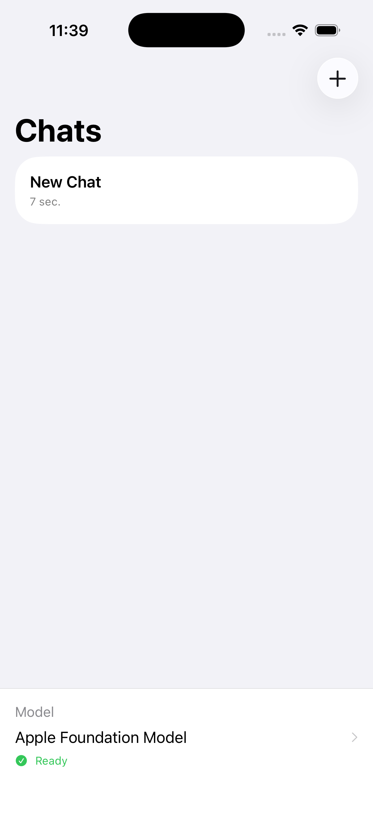

# BaseChatKit

A modular SwiftUI framework for building chat interfaces powered by local and cloud LLMs on Apple platforms.

BaseChatKit provides a complete, production-ready chat UI with pluggable inference backends, model management, and SwiftData persistence. Drop it into your app, register backends, and you have a working chat interface.

## Demo

<!-- TODO: Replace these placeholders with actual screenshots captured from the Example app.
     Capture instructions:
       1. Run the Example app in the iOS Simulator
       2. Use `xcrun simctl io booted screenshot Example/Screenshots/demo.png`
          or record a GIF with QuickTime + Gifski (~10-15 seconds, ~600px wide)
       3. Capture: a chat conversation mid-stream, the session list sidebar,
          and the model management sheet / HuggingFace browser tab
       4. Optimise the image and commit it to Example/Screenshots/
       5. Update the image path below and remove this comment block
     Optionally add both light and dark mode screenshots side by side. -->



## Features

- **Multiple inference backends** — GGUF (llama.cpp), MLX (Apple Silicon), Apple Foundation Models, OpenAI, Claude, Ollama, LM Studio, and custom OpenAI-compatible APIs
- **Complete SwiftUI interface** — Chat view, session management, model browser, generation settings, export
- **HuggingFace integration** — Search, browse, and download models directly from the Hub
- **Background downloads** — iOS background transfer support with progress tracking and GGUF/MLX validation
- **SwiftData persistence** — Chat sessions, messages, and API endpoint configuration
- **Context window management** — Automatic message trimming with token estimation
- **Memory pressure monitoring** — Auto-unloads models when the system is under pressure
- **Secure API key storage** — Keychain-backed with just-in-time retrieval (keys never held in memory)
- **Certificate pinning** — Configurable SPKI hash pinning for cloud API connections

## Requirements

- Swift 5.9+
- iOS 17+ / macOS 14+
- Apple Foundation Models require iOS 26+ / macOS 26+

## Architecture

BaseChatKit is split into three targets with a clean dependency graph:

```
BaseChatUI  ──────────>  BaseChatCore  <──────────  BaseChatBackends
(Views, ViewModels)      (Protocols, Models,        (MLX, llama.cpp,
                          Services)                  Foundation, Cloud)
```

- **BaseChatCore** — Models, protocols, and services. No ML dependencies. This is the integration point for custom backends.
- **BaseChatBackends** — Concrete inference backend implementations. Depends on MLX, llama.cpp, and cloud APIs.
- **BaseChatUI** — SwiftUI views and view models. Depends only on BaseChatCore.

## Quick Start

### 1. Add the package

```swift
.package(url: "https://github.com/roryford/BaseChatKit.git", from: "1.0.0")
```

Add the targets you need:

```swift
.target(name: "MyApp", dependencies: [
    .product(name: "BaseChatCore", package: "BaseChatKit"),
    .product(name: "BaseChatBackends", package: "BaseChatKit"),
    .product(name: "BaseChatUI", package: "BaseChatKit"),
])
```

### 2. Configure at app startup

```swift
import BaseChatCore
import BaseChatBackends
import BaseChatUI

@main
struct MyApp: App {
    @State private var chatViewModel: ChatViewModel
    @State private var sessionManager = SessionManagerViewModel()
    @State private var modelManagement: ModelManagementViewModel
    private let modelContainer: ModelContainer

    init() {
        // 1. Configure the framework
        BaseChatConfiguration.shared = BaseChatConfiguration(
            appName: "My Chat App",
            bundleIdentifier: "com.example.mychatapp"
        )

        // 2. Create and register backends
        let inferenceService = InferenceService()
        DefaultBackends.register(with: inferenceService)

        // 3. Create view models
        let vm = ChatViewModel(inferenceService: inferenceService)
        vm.foundationModelProvider = {
            if #available(iOS 26, macOS 26, *) {
                return FoundationBackend.isAvailable
            }
            return false
        }
        _chatViewModel = State(initialValue: vm)

        // 4. Set up model management (optional — for HuggingFace downloads)
        let downloadManager = BackgroundDownloadManager()
        let hfService = HuggingFaceService()
        _modelManagement = State(initialValue: ModelManagementViewModel(
            huggingFaceService: hfService,
            downloadManager: downloadManager
        ))

        modelContainer = try! ModelContainerFactory.makeContainer()
    }

    var body: some Scene {
        WindowGroup {
            ContentView()
                .environment(chatViewModel)
                .environment(modelManagement)
                .environment(sessionManager)
        }
        .modelContainer(modelContainer)
    }
}
```

### 3. Wire up the UI

```swift
struct ContentView: View {
    @Environment(ChatViewModel.self) private var viewModel
    @Environment(SessionManagerViewModel.self) private var sessionManager
    @Environment(\.modelContext) private var modelContext

    var body: some View {
        NavigationSplitView {
            SessionListView()
        } detail: {
            ChatView(showModelManagement: .constant(false))
        }
        .onAppear {
            viewModel.configure(modelContext: modelContext)
            sessionManager.configure(modelContext: modelContext)
            viewModel.refreshModels()
            sessionManager.loadSessions()

            if sessionManager.sessions.isEmpty {
                sessionManager.createSession()
            }
        }
        .onChange(of: sessionManager.activeSession) { _, session in
            if let session { viewModel.switchToSession(session) }
        }
    }
}
```

## Supported Model Types

| Type | Backend | Format | Source |
|------|---------|--------|--------|
| GGUF | `LlamaBackend` (llama.cpp) | Single `.gguf` file | HuggingFace, local |
| MLX | `MLXBackend` (mlx-swift) | Directory with `config.json` + `.safetensors` | HuggingFace, local |
| Foundation | `FoundationBackend` | Built-in (no download) | Apple Intelligence |
| OpenAI | `OpenAIBackend` | Cloud API | api.openai.com |
| Claude | `ClaudeBackend` | Cloud API | api.anthropic.com |
| Ollama | `OpenAIBackend` | Local API | localhost:11434 |
| LM Studio | `OpenAIBackend` | Local API | localhost:1234 |

## Key Types

### View Models

| Type | Purpose |
|------|---------|
| `ChatViewModel` | Central chat controller — messages, generation, model loading, settings |
| `SessionManagerViewModel` | Chat session CRUD and selection |
| `ModelManagementViewModel` | HuggingFace search, downloads, local model management |

### Services

| Type | Purpose |
|------|---------|
| `InferenceService` | Backend orchestrator — selects and delegates to the right backend |
| `BackgroundDownloadManager` | Background model downloads with progress and validation |
| `ModelStorageService` | Local model file discovery and storage paths |
| `DeviceCapabilityService` | RAM/chipset queries for model size recommendations |
| `KeychainService` | Secure API key storage |
| `ContextWindowManager` | Token estimation and message trimming |
| `HuggingFaceService` | HuggingFace Hub API (search, model info, download URLs) |

### Views

| View | Purpose |
|------|---------|
| `ChatView` | Main chat interface with message list and input bar |
| `SessionListView` | Sidebar session list with rename/delete |
| `ModelBrowserView` | HuggingFace model search and download |
| `GenerationSettingsView` | Temperature, top-p, system prompt, prompt template |
| `APIConfigurationView` | Cloud API endpoint management |
| `ModelManagementSheet` | Combined model browser + storage management |

### Protocols

| Protocol | Purpose |
|----------|---------|
| `InferenceBackend` | Common interface for all inference engines |
| `SSEPayloadHandler` | Interprets SSE JSON payloads for cloud API streaming |
| `ConversationHistoryReceiver` | Passes multi-turn history to cloud backends |
| `TokenUsageProvider` | Reports token usage from cloud API responses |
| `HuggingFaceServiceProtocol` | Abstraction for HuggingFace Hub operations |

## Custom Backends

Implement `InferenceBackend` and register it:

```swift
class MyBackend: InferenceBackend, @unchecked Sendable {
    var isModelLoaded = false
    var isGenerating = false
    var capabilities: BackendCapabilities { /* ... */ }

    func loadModel(from url: URL, contextSize: Int32) async throws { /* ... */ }
    func generate(prompt: String, systemPrompt: String?, config: GenerationConfig)
        throws -> AsyncThrowingStream<String, Error> { /* ... */ }
    func stopGeneration() { /* ... */ }
    func unloadModel() { /* ... */ }
}

// Register
inferenceService.registerBackendFactory { modelType in
    switch modelType {
    case .gguf: return MyBackend()
    default: return nil
    }
}
```

## Curated Model Recommendations

Provide device-appropriate model suggestions:

```swift
CuratedModel.all = [
    CuratedModel(
        id: "my-model",
        displayName: "My Model (Q4)",
        fileName: "my-model-q4.gguf",
        repoID: "myorg/my-model-GGUF",
        modelType: .gguf,
        approximateSizeBytes: 4_000_000_000,
        recommendedFor: [.medium, .large, .xlarge],
        contextSize: 4096,
        promptTemplate: .chatML,
        description: "A great model"
    ),
]
```

Recommendations are filtered by `DeviceCapabilityService.recommendedModelSize()` based on available RAM.

## Cloud API Configuration

Cloud endpoints are persisted via SwiftData. Users configure them through `APIConfigurationView`, or you can create them programmatically:

```swift
let endpoint = APIEndpoint(
    name: "My OpenAI",
    provider: .openAI,
    baseURL: "https://api.openai.com",
    modelName: "gpt-4o-mini"
)
endpoint.setAPIKey("sk-...")  // Stored in Keychain
```

## Prompt Templates

GGUF models require explicit chat formatting. BaseChatKit includes templates for:

- **ChatML** — `<|im_start|>user\n...<|im_end|>`
- **Llama 3** — `<|start_header_id|>user<|end_header_id|>\n\n...<|eot_id|>`
- **Mistral** — `[INST] ... [/INST]`
- **Alpaca** — `### Instruction:\n...\n### Response:`
- **Gemma** — `<start_of_turn>user\n...<end_of_turn>`
- **Phi** — `<|user|>\n...<|end|>`

Templates auto-detect from GGUF metadata when available. User content is sanitised to strip special tokens and prevent prompt injection.

## Security

- API keys stored in Keychain with `kSecAttrAccessibleWhenUnlockedThisDeviceOnly`
- Keys read just-in-time from Keychain, never held as stored properties
- Certificate pinning support via `PinnedSessionDelegate` — configure `pinnedHosts` with SPKI SHA-256 hashes; `api.openai.com` and `api.anthropic.com` fail closed if pin sets are missing/empty, while localhost and custom hosts retain existing bypass/default-trust behavior
- HTTPS enforced for non-localhost endpoints
- User content sanitised in prompt templates to prevent injection
- Sensitive data uses `privacy: .private` in os.Logger calls
- Error response bodies filtered before logging

## Binary Dependencies

`BaseChatBackends` includes two pre-built binary xcframeworks:

- **llama.swift** — wraps a pre-built llama.cpp xcframework. The binary is not compiled from source as part of your project. If you require a source-verified build, follow the [llama.swift build instructions](https://github.com/mattt/llama.swift) to compile your own xcframework.
- **mlx-swift** — Apple's MLX framework ships as a pre-built xcframework from [ml-explore/mlx-swift](https://github.com/ml-explore/mlx-swift). Source builds are supported via that upstream repo.

Both dependencies are pinned to specific tagged releases in `Package.swift`. Review `Package.resolved` to verify the exact versions in use.

## Example App

See the `Example/` directory for a complete demo app showing integration patterns.

```bash
cd Example
open BaseChatDemo.xcodeproj
```

## License

MIT License. See [LICENSE](LICENSE) for details.
